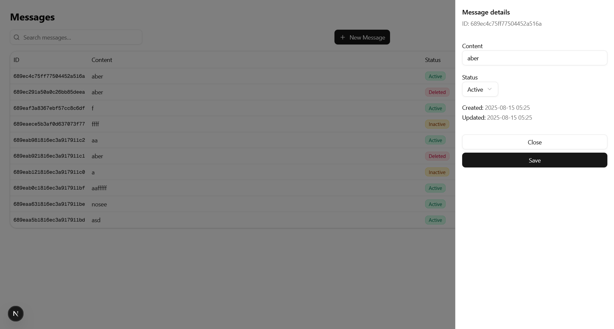

# 📦 Semantiks
Simple API for message management

---

## 📜 Table of Contents
1. [Overview](#overview)
2. [Architecture](#architecture)
3. [Components](#components)
4. [Entities](#entities)
5. [Tech Stack](#tech-stack)
6. [Getting Started](#getting-started)
7. [Environment Variables](#environment-variables)
8. [API Documentation](#api-documentation)
9. [Example Requests](#example-requests)
10. [Images](#images)

## Overview
This application allows AI prompts management through an API.

Includes:
- message listing
- message updates
- message retrieval
- message creation

## Architecture


- **Client**: NextJS frontend consuming the API.
- **API**: REST API built with FastAPI.
- **Database**: MongoDB for persistent storage.

## Components


- We will be display all information on the base route.
- Slide in bar for existing data table messages
- Modal popup for new messages.

## Entities


Messages will contain ai prompts.

- _id: uuid autogenerated
- content: prompt content
- status: prompt status (active, inactive)
- timestamps

## Tech Stack
- **Frontend**: NextJS
- **Backend**: FastAPI (Python 3.11+)
- **Database**: MongoDB
- **API Docs**: Swagger UI / ReDoc (auto-generated)
- **Containerization**: Docker (optional)

## Getting Started

### Prerequisites
- Python 3.11+
- pip
- MongoDB (local or cloud, e.g., Atlas)


### Installation
```bash
git clone https://github.com/gonzasestopal/semantiks.git
cd semantiks
pip install -r requirements.txt
```

Run server

```
uvicorn backend.server.app:app --reload
````

## API Docs

- Swagger UI: http://localhost:8000/docs
- ReDoc: http://localhost:8000/redoc
- OpenAPI JSON: http://localhost:8000/openapi.json

## Environment Variables
Create a .env file in the root directory:

```
MONGO_URI=mongodb://localhost:27017
DB_NAME=your_db_name
````

## API Documentation

Base URL:
- **Local:** `http://localhost:8000`

Authentication:
- None is required

### Messages
| Method | Endpoint            | Description
|--------|---------------------|--------------------------
| GET    | `/messages`         | List all messages
| POST   | `/messages`         | Create a new messages
| GET    | `/messages/{id}`    | Get a messages by ID
| PUT    | `/messages/{id}`    | Update a messages by ID

### Example Requests

**GET /messages**
```http
GET /messages HTTP/1.1
Host: http://localhost:8000
```
**Response 200**
```
[
  {
    "_id_": "984a3b0d-7fc4-4e46-a19e-83df96db61cf",
    "content": "Please show me the weather of X",
    "status": "active",
    "created_at": "2025-08-14T15:42:30Z",
    "updated_at": "2025-08-14T15:42:30Z"
  },
  {
    "_id_": "984a3b0d-7fc4-4e46-a19e-83df96db61cf",
    "content": "Is this the normal weather of X?",
    "status": "active",
    "created_at": "2025-08-14T18:42:30Z",
    "updated_at": "2025-08-14T18:42:30Z"
  }
]
```

**POST /messages**
```http
POST /messages HTTP/1.1
Host: http://localhost:8000
Content-Type: application/json
```

```
{
  "content": "Can you show me the weather of previous week?",
}
```
**Response 201**
```
{
  "_id": "984a3b0d-7fc4-4e46-a19e-83df96db61cf",
  "content": "Can you show me the weather of previous week?",
  "status": "active",
  "created_at": "2025-08-14T15:42:30Z"
  "updated_at": "2025-08-14T18:42:30Z"

}
```
**GET /messages/{id}**
```http
GET /messages/12345 HTTP/1.1
Host: http://localhost:8000
Content-Type: application/json
```

**Response 200**
```
{
  "_id": "984a3b0d-7fc4-4e46-a19e-83df96db61cf",
  "content": "Is this the normal weather of X?",
  "status": "active",
  "created_at": "2025-08-14T15:42:30Z",
  "updated_at": "2025-08-14T18:42:30Z"
}
```
**Response 404**
```
{
  "error": "Message not found",
  "id": "12345"
}
```
**PUT /messages**
```http
PUT /messages HTTP/1.1
Host: http://localhost:8000
Content-Type: application/json
```

```
{
  "status": "inactive"
}
```
**Response 200**
```
{
  "_id": "984a3b0d-7fc4-4e46-a19e-83df96db61cf",
  "content": "Is this the normal weather of X?",
  "status": "inactive",
  "created_at": "2025-08-14T15:42:30Z",
  "updated_at": "2025-08-14T20:10:05Z"
}
```
**Response 404**
```
{
  "error": "Message not found",
  "_id": "984a3b0d-7fc4-4e46-a19e-83df96db61cf"
}
```

## Images




